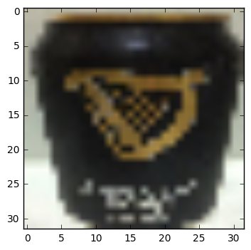
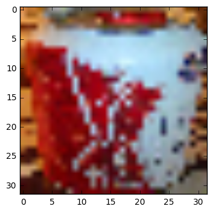
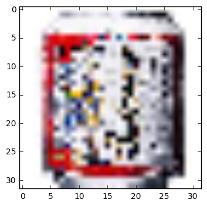

# Beer Discriminator
ビールか疑似ビールかを識別するアプリケーション  
2016/11/27  
@第12回ファジィ学問塾    

## Summary
お酒を飲まなくなっている若者がビール好きな年長者に間違えず確実に手渡したいというニーズを解決するために，瞬時にビールかどうかを識別し使用者に提案するアプリケーションを作成する．  
ビールと疑似ビール(beer taste drinks, 第3のビールなど)をその正面のデザインから視覚的に識別するプログラムを作成し，性能を検証した．  

## Members
- 庵  
- 松岡(yumatsuoka)    
- 大西  
- 徳田  

## Method
- Convolutional Neural Network(CNN)  

## Dataset
- 32*32サイズのRGB缶ビールの正面画像　　
- ビール画像408枚と発泡酒と第3のビール画像251枚で構成される　　
- 画像群はGoogle画像検索とAmazonの商品画像よりクローリング　　

sample images(beer, resized 320*320)  
  
  
  

## Requirements
- Python(checked python 2.7.6)  
- jupyter(checked jupyter 1.0.0)
- tensorflow(checked tensorflow 1.12.0)
- Matplotlib(checked matplotlib 1.5.1)  
- Numpy(checked numpy 1.10.4)  
- Pillow(checked Pillow 3.3.0)  
- pandas(checked pandas 0.18.0)  

## Details
(2016/11/30 追記)データセットは32*32サイズにリサイズしたものをall_imgs_dic.pklとしてdumpして置いています。元データはサンプルとして6枚ずつimg/beer, img/happoshuにおいています．
Add some codes and files. One code which mades a csv file which has images pass and target labels and another is which classifies whether a input image is a beer one with CNN. all_imgs_dic.pkl is dumped image dataset file which is a python dictionary which has 'data' and 'target' keyes. They're correspond with the data and targets on the dataset. all_img.csv has images passes and its targets.   
